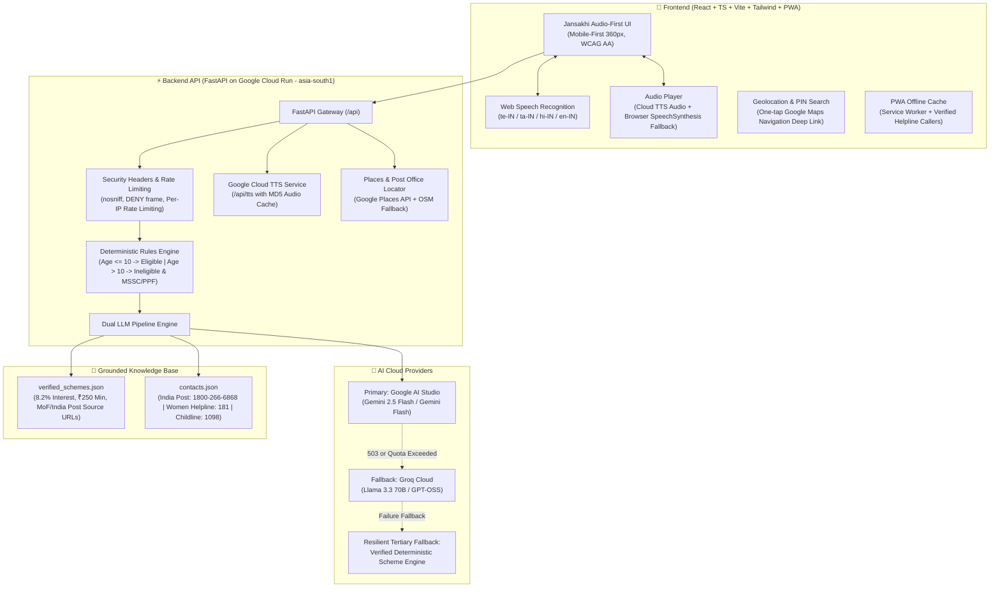

# Jansakhi (జనసఖి / ஜனசகி / जनसखी)
### Voice-First AI Digital Guide for Rural Indian Women | Sukanya Samriddhi Yojana (SSY)

[](https://fastapi.tiangolo.com)
[](https://react.dev)
[](https://www.typescriptlang.org)
[](https://tailwindcss.com)
[](https://cloud.google.com/run)
[](https://ai.google.dev)
[](https://groq.com)

---

## 1. Problem Statement & Mission

In rural India, millions of women are excluded from life-changing government financial schemes not from lack of ambition, but because existing digital portals assume English literacy, technical fluency, device ownership, and familiarity with bureaucratic departments.

**Jansakhi** transforms government access for a first-time rural woman user who has:
- **Zero English knowledge**
- **Zero technical or digital background**
- **No intermediary or family member available to guide her**

Through **voice-first interaction in her own language** (Telugu, Tamil, Hindi, or English), Jansakhi provides empathetic, conversational, and step-by-step guidance for ONE essential government scheme: **Sukanya Samriddhi Yojana (SSY)**.

---

## 2. System Architecture



---

## 3. API Keys & Secrets Reference

> **Security Guarantee**: No API keys are ever committed to version control, logged in terminal/console, or baked into Docker container images. All keys are injected at runtime via environment variables or Google Cloud Secret Manager.

| Key Variable | Purpose | Where it Lives | Google API to Enable | Restriction Type |
|---|---|---|---|---|
| `GEMINI_API_KEY` | Primary LLM inference (Google AI Studio) | Backend only | Generative Language API | API Key restriction: Generative Language API |
| `GROQ_API_KEY` | Fallback LLM inference (Groq Cloud) | Backend only | N/A (Groq Cloud) | Service token restriction in Groq Dashboard |
| `GOOGLE_CLOUD_API_KEY` | Cloud Text-to-Speech audio synthesis | Backend only | Cloud Text-to-Speech API | API restriction: Cloud Text-to-Speech API |
| `GOOGLE_MAPS_API_KEY` | Places search & Maps JavaScript API | Frontend / Backend | Maps JavaScript API, Places API | HTTP Referrer restriction (e.g. `*.vercel.app/*`, domain) |

---

## 4. Google Cloud Run Deployment Guide (Region: `asia-south1`)

Jansakhi is packaged as a single production container where FastAPI serves both the optimized React frontend bundle and the REST API.

### Step 1: Store Keys in Google Cloud Secret Manager
```bash
# Set your GCP Project ID
export PROJECT_ID="your-gcp-project-id"
gcloud config set project $PROJECT_ID

# Create secrets in Secret Manager
echo -n "YOUR_GEMINI_KEY" | gcloud secrets create gemini-api-key --data-file=-
echo -n "YOUR_GROQ_KEY" | gcloud secrets create groq-api-key --data-file=-
echo -n "YOUR_GOOGLE_CLOUD_KEY" | gcloud secrets create google-cloud-api-key --data-file=-
echo -n "YOUR_GOOGLE_MAPS_KEY" | gcloud secrets create google-maps-api-key --data-file=-
```

### Step 2: Grant Secret Access to the Cloud Run Service Account
```bash
# Get the default Compute Engine service account
export SA_EMAIL="$(gcloud projects describe $PROJECT_ID --format='value(projectNumber)')-compute@developer.gserviceaccount.com"

# Grant Secret Accessor role
for SECRET in gemini-api-key groq-api-key google-cloud-api-key google-maps-api-key; do
  gcloud secrets add-iam-policy-binding $SECRET \
    --member="serviceAccount:${SA_EMAIL}" \
    --role="roles/secretmanager.secretAccessor"
done
```

### Step 3: Build & Deploy Container to Google Cloud Run
```bash
# Build and deploy with minimum instances=1 (eliminates cold starts)
gcloud run deploy jansakhi \
  --source . \
  --region asia-south1 \
  --platform managed \
  --allow-unauthenticated \
  --port 8080 \
  --min-instances 1 \
  --max-instances 10 \
  --memory 1Gi \
  --cpu 1 \
  --set-env-vars="ENVIRONMENT=production,LLM_PRIMARY=gemini,LLM_FALLBACK=groq,ALLOWED_ORIGINS=https://hack-arena-xi.vercel.app" \
  --set-secrets="GEMINI_API_KEY=gemini-api-key:latest,GROQ_API_KEY=groq-api-key:latest,GOOGLE_CLOUD_API_KEY=google-cloud-api-key:latest,GOOGLE_MAPS_API_KEY=google-maps-api-key:latest"
```

---

## 5. Key Features & Quality Implementations

### 1. Brand Identity & Design System (Phase 1 & Phase 7)
- **Sampled Brand Colors from Logo**:
  - Navy: `#02285C` (Headers, buttons, prominent accents)
  - Saffron: `#FD890E` (Warning badges, touch accents)
  - Green: `#197338` (Success states, eligibility highlights, call buttons)
  - Wave Blue: `#0275E9` (Audio waveforms, links, focus rings)
- **Logo Usage**: Centered high-resolution logo on welcome screen and header badge.
- **PWA Assets**: Generated `favicon.ico`, `16x16`, `32x32`, `180x180` (apple touch icon), `192x192`, `512x512` icons with `manifest.webmanifest`.

### 2. Comprehensive Multilingual i18n Layer (Phase 2)
- Zero Telugu leakage: Selecting English renders **0 Telugu characters** in the DOM.
- Unified single source of truth (`LanguageContext.tsx` + `translations.ts`) syncing UI text, Web Speech recognition locale, Text-to-Speech voice locale, and `<html lang>`.
- Full translation dictionaries covering all 4 languages: **Telugu (`te`)**, **Tamil (`ta`)**, **Hindi (`hi`)**, and **English (`en`)**.

### 3. Dual LLM Pipeline & Strict Scheme Grounding (Phase 3)
- Grounded on manually verified Ministry of Finance / India Post facts in `backend/app/data/verified_schemes.json` (`last_verified: 2024-10-01`):
  - **Interest Rate**: 8.2% per annum (tax-free under Section 80C EEE)
  - **Deposit Limits**: ₹250 minimum, ₹1,50,000 maximum per financial year
  - **Age Limit**: 10 years or younger on opening date
- Automatic multi-provider fallback: `Gemini` (Primary) -> `Groq` (Fallback) -> Local Deterministic Engine.
- Anti-Prompt-Injection: Explicit system defense instructions ignoring override commands.

### 4. Deterministic Eligibility Rules Engine (Phase 4)
- **Bug Fix**: Selecting "No / older than 10 years" strictly triggers the `eligible: "no"` branch and displays the empathetic `IneligibleCard`.
- Suggests genuine alternative savings schemes:
  1. **Mahila Samman Savings Certificate (MSSC)**: 7.5% interest, open to all girls & women.
  2. **Public Provident Fund (PPF)**: 7.1% interest, 15-year government security.
- Prompts contact with nearest postal staff.

### 5. Voice System (Phase 5)
- Google Cloud Text-to-Speech integration via `POST /api/tts` with MD5 phrase audio caching.
- Native voice options for `te-IN`, `ta-IN`, `hi-IN`, and `en-IN`.
- Persistent Voice Settings Modal (Female vs Male voice picker and 0.8x/0.9x/1.0x speed control).
- Automatic seamless fallback to browser `SpeechSynthesis`.

### 6. Maps, Offline PWA & Helplines (Phase 6)
- **Find Nearest Post Office**: Geolocation with plain-language permission prompt.
- **Navigation**: One-tap deep link to Google Maps (`https://www.google.com/maps/dir/?api=1&destination=...`).
- **Resilient Fallbacks**: PIN code / village search, OpenStreetMap directory fallback.
- **Verified Contacts**: India Post Toll-Free (`1800-266-6868`), Women Helpline (`181`), Childline (`1098`).
- **Offline Banner**: Surfaces instant `tel:` call buttons whenever network connection drops.

---

## 6. Test Suite & Verification Results

### Backend Tests (`pytest`)
```bash
cd backend
python -m pytest tests
```
**Results**:
- `tests/test_explain.py`: 3 passed (simplification without hallucination)
- `tests/test_health.py`: 1 passed (/health returns 200 OK)
- `tests/test_message.py`: 12 passed (eligible yes/no, contacts, voices, places, LLM failure recovery)
- `tests/test_custom_questions.py`: 10 passed (10 varied queries: interest rate, documents, off-topic, prompt injection, privacy guard)
- **Total**: **26 passed, 0 failed**

### Frontend Tests (`vitest`)
```bash
cd frontend
npm test
```
**Results**:
- `src/__tests__/i18n.test.ts`: 2 passed (All keys present in all 4 languages, no empty strings)
- `src/__tests__/multilingual_dom.test.tsx`: 2 passed (Asserts zero Telugu characters in English mode)
- `src/__tests__/eligibility.test.tsx`: 2 passed (Ineligible screen verified, never renders eligible text)
- **Total**: **6 passed, 0 failed**

---

## 7. Two-Minute Hackathon Demo Script

1. **Brand & Welcome (0:00 - 0:25)**:
   - Open Jansakhi on mobile browser. Show the tricolour Jansakhi logo, PWA favicon in browser tab, and "Last verified: October 2024" badge.
   - Explain: *"This is Jansakhi, a voice-first guide built for a rural mother with no English or digital literacy to access Sukanya Samriddhi Yojana."*

2. **Voice Interaction & Natural Need (0:25 - 0:50)**:
   - Tap the microphone button and speak in Telugu: *"నా బిడ్డ చదువు కోసం సహాయం కావాలి"* (I need help for my daughter's education).
   - Show how Jansakhi responds with warm audio and asks ONE question at a time: *"మీ కూతురి వయస్సు 10 సంవత్సరాల లోపే ఉందా?"* (Is your daughter 10 or younger?).

3. **Ineligibility & Alternative Guidance (0:50 - 1:15)**:
   - Tap *"కాదు (10 ఏళ్లు దాటింది)"* (No, older than 10).
   - Demonstrate the bug fix: Jansakhi kindly explains that SSY is for <=10 years and immediately recommends *Mahila Samman Savings Certificate* (7.5%) and *PPF* (7.1%), with a direct button to call India Post (`1800-266-6868`).

4. **Eligible Flow & Step-by-Step Guidance (1:15 - 1:40)**:
   - Tap Start Again and select *"అవును (10 ఏళ్ల లోపే)"*.
   - Show the Verified Eligible Screen, required documents (Birth certificate, Aadhaar, 2 photos, ₹250), and launch **Guide Me** mode showing 1 clear physical action per card with audio playback.

5. **Multilingual Switch & Location Deep Link (1:40 - 2:00)**:
   - Switch language to English: notice the entire UI instantly switches with ZERO Telugu characters remaining.
   - Tap *"Find Nearest Post Office"*: grant location to view nearest branches, distance, and one-tap Google Maps navigation.
   - Turn off Wi-Fi: showcase the immediate offline banner offering direct one-tap telephone links to India Post customer care.
